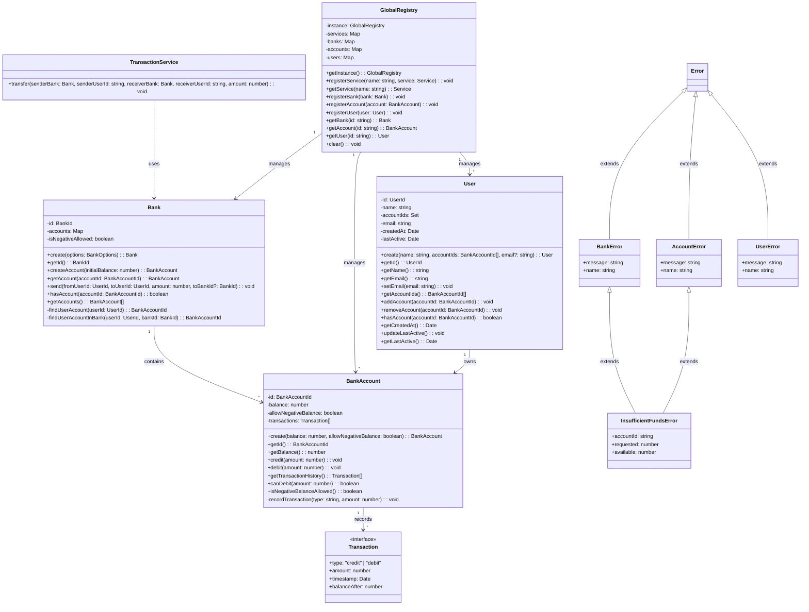

# System Architecture

## Class Diagram

```mermaid
classDiagram
    class Bank {
        -id: BankId
        -accounts: Map<BankAccountId, BankAccount>
        -isNegativeAllowed: boolean
        +create(options: BankOptions): Bank
        +getId(): BankId
        +createAccount(initialBalance: number): BankAccount
        +getAccount(accountId: BankAccountId): BankAccount
        +send(fromUserId: UserId, toUserId: UserId, amount: number, toBankId?: BankId): void
        +hasAccount(accountId: BankAccountId): boolean
        +getAccounts(): BankAccount[]
        -findUserAccount(userId: UserId): BankAccountId
        -findUserAccountInBank(userId: UserId, bankId: BankId): BankAccountId
    }

    class BankAccount {
        -id: BankAccountId
        -balance: number
        -allowNegativeBalance: boolean
        -transactions: Transaction[]
        +create(balance: number, allowNegativeBalance: boolean): BankAccount
        +getId(): BankAccountId
        +getBalance(): number
        +credit(amount: number): void
        +debit(amount: number): void
        +getTransactionHistory(): Transaction[]
        +canDebit(amount: number): boolean
        +isNegativeBalanceAllowed(): boolean
        -recordTransaction(type: string, amount: number): void
    }

    class Transaction {
        <<interface>>
        +type: "credit" | "debit"
        +amount: number
        +timestamp: Date
        +balanceAfter: number
    }

    class TransactionService {
        +transfer(senderBank: Bank, senderUserId: string, receiverBank: Bank, receiverUserId: string, amount: number): void
    }

    class User {
        -id: UserId
        -name: string
        -accountIds: Set<BankAccountId>
        -email: string
        -createdAt: Date
        -lastActive: Date
        +create(name: string, accountIds: BankAccountId[], email?: string): User
        +getId(): UserId
        +getName(): string
        +getEmail(): string
        +setEmail(email: string): void
        +getAccountIds(): BankAccountId[]
        +addAccount(accountId: BankAccountId): void
        +removeAccount(accountId: BankAccountId): void
        +hasAccount(accountId: BankAccountId): boolean
        +getCreatedAt(): Date
        +updateLastActive(): void
        +getLastActive(): Date
    }

    class GlobalRegistry {
        -instance: GlobalRegistry
        -services: Map<string, Service>
        -banks: Map<string, Bank>
        -accounts: Map<string, BankAccount>
        -users: Map<string, User>
        +getInstance(): GlobalRegistry
        +registerService(name: string, service: Service): void
        +getService(name: string): Service
        +registerBank(bank: Bank): void
        +registerAccount(account: BankAccount): void
        +registerUser(user: User): void
        +getBank(id: string): Bank
        +getAccount(id: string): BankAccount
        +getUser(id: string): User
        +clear(): void
    }

    class BankError {
        +message: string
        +name: string
    }

    class InsufficientFundsError {
        +accountId: string
        +requested: number
        +available: number
    }

    class AccountError {
        +message: string
        +name: string
    }

    class UserError {
        +message: string
        +name: string
    }

    Bank "1" --> "*" BankAccount : contains
    User "1" --> "*" BankAccount : owns
    GlobalRegistry "1" --> "*" Bank : manages
    GlobalRegistry "1" --> "*" BankAccount : manages
    GlobalRegistry "1" --> "*" User : manages
    TransactionService ..> Bank : uses
    BankAccount "1" --> "*" Transaction : records
    BankError <|-- InsufficientFundsError : extends
    AccountError <|-- InsufficientFundsError : extends
    Error <|-- BankError : extends
    Error <|-- AccountError : extends
    Error <|-- UserError : extends

```
