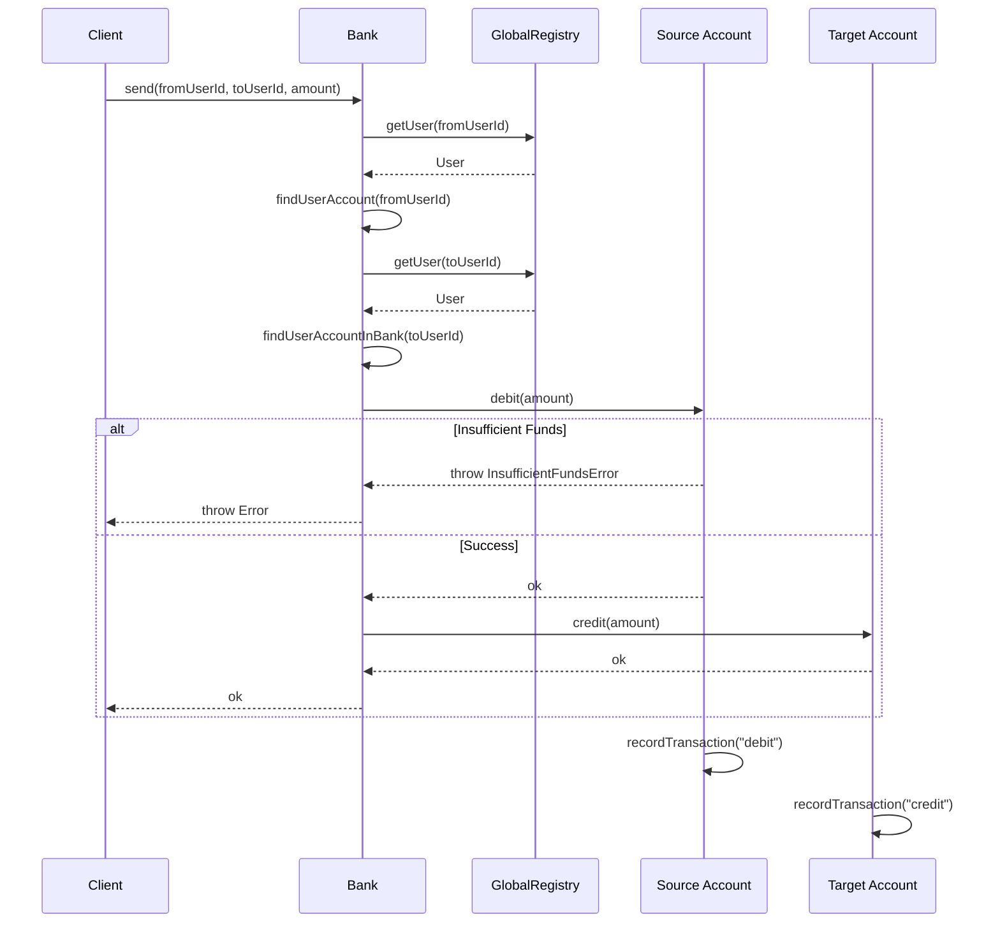
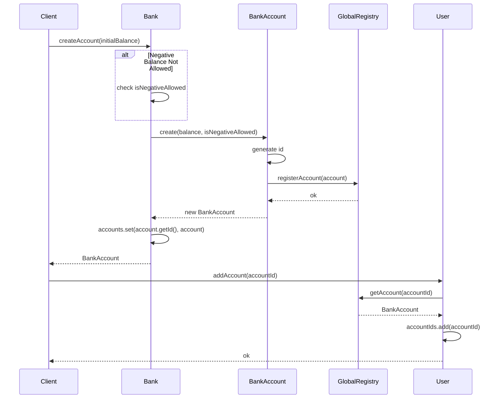
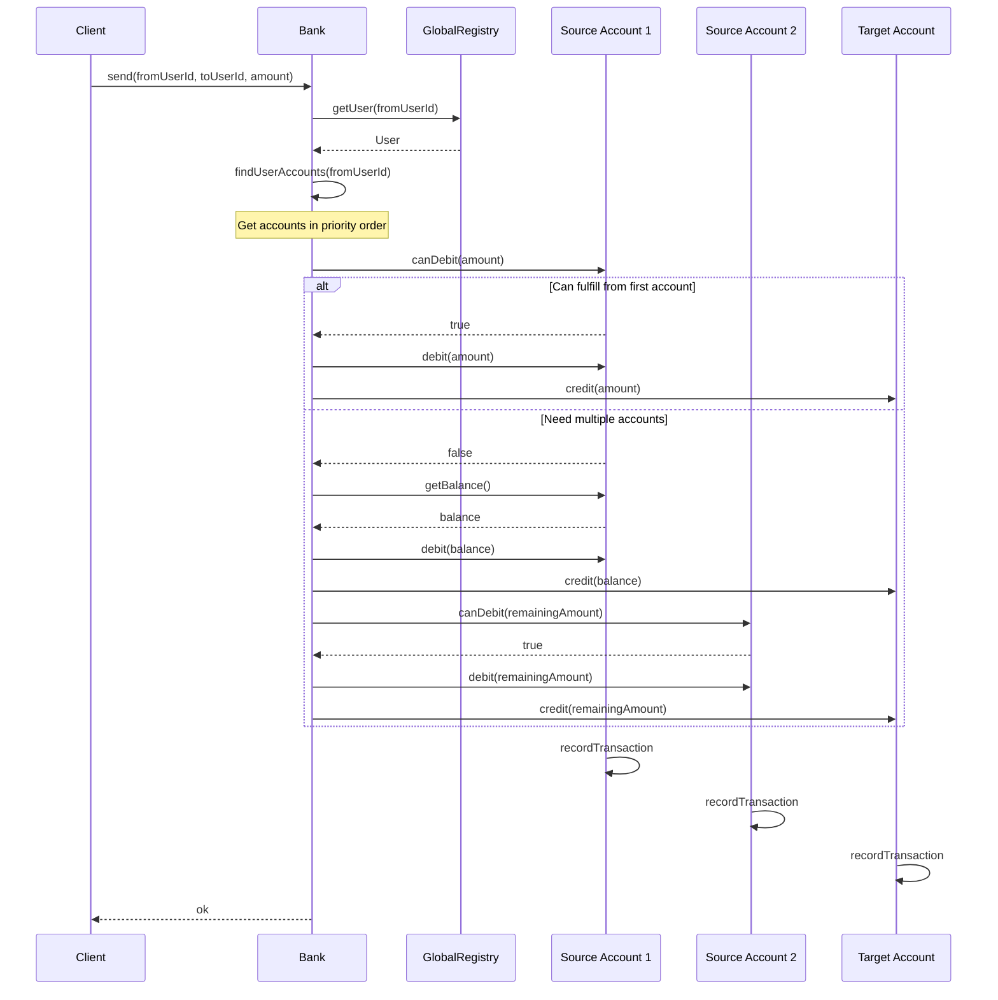

# sequences

<!-- Section break -->

## Transfer Money

<!-- Diagram description -->

_This diagram shows the flow of money transfer between accounts_

<!-- Section break -->

## Account Creation

<!-- Diagram description -->

_This diagram illustrates the account creation process_

<!-- Section break -->

# Multi-Account Transfer

<!-- Diagram description -->

_This diagram illustrates the account creation process_

